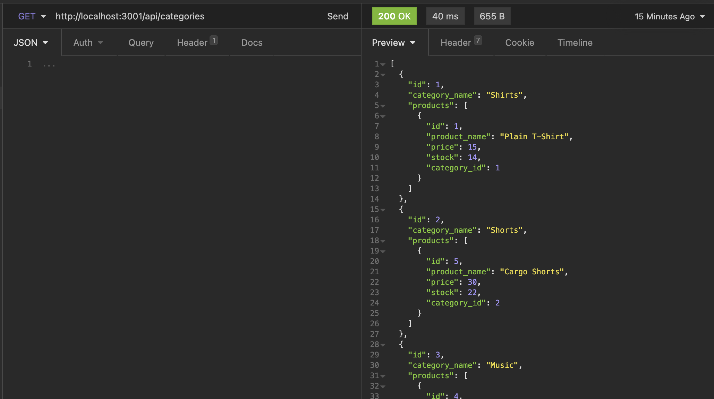

# E-Commerce Back End ©2021 

## Description

This is an ecommerce back end for a clothing or music store

Project by: Aimee J  
Main Github: [MissAimeeJay](https://github.com/MissAimeeJay)
Repository Link: https://github.com/MissAimeeJay/e-commerce-back-end  
Link to video found [Here](https://drive.google.com/file/d/10pEPCyR5_80PBjgN0kC9YUsoFx8j27Dw/view)

## Table of Contents

* [Installation](#installation)
* [Usage](#usage)
* [License](#license)
* [Testing](#testing)
* [Questions](#questions)

## Installation
This project requires installation of Node, Sequelize (MySql), dotenv, (npm init to initiate json package), and use of Datatypes (included).  Express router is frequently used for this project as well!

## Usage 
npm install sequelize express dotenv 

## License

[Click here for more information on this license](https://choosealicense.com/licenses/unlicense)

## Testing
Insomnia was used to test api CRUD for this project.

## Questions
If you have questions or would like to contact for other reasons, please contact
Aimee J  
Email: ajesso@post.com
Main Github: [MissAimeeJay](https://github.com/MissAimeeJay)